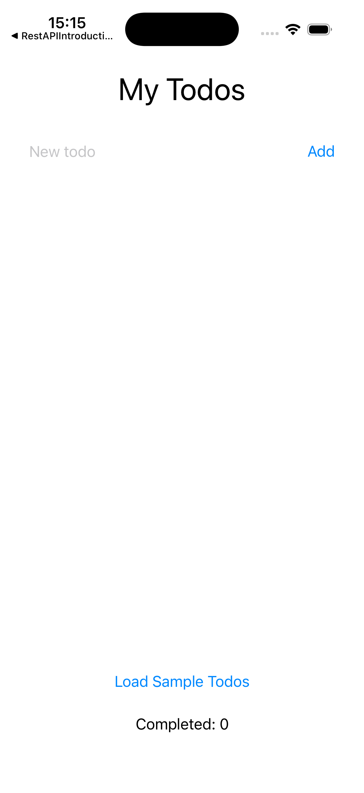
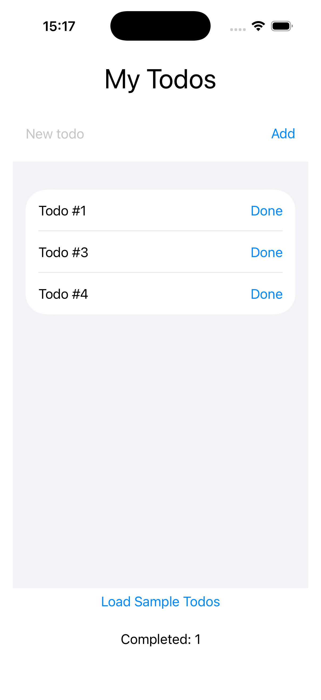
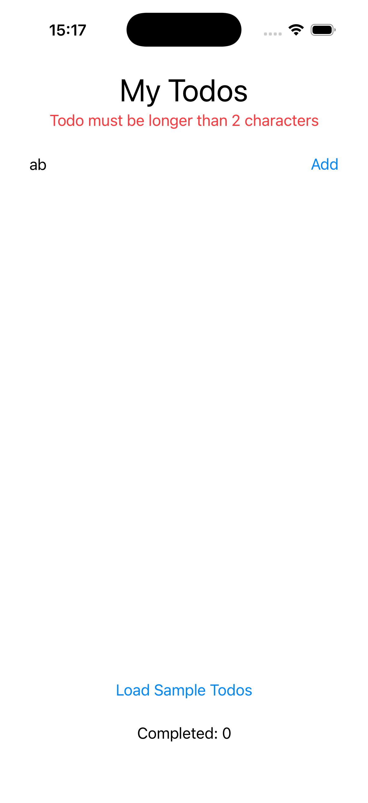

# Laboratory-7---Exercise
# Laboratory Exercise 7 — MVVM Refactor

**Course:** Programming in Objective‑C/Swift — *Selected architectural patterns in SwiftUI*
**Task:** Take the sample code (`simple_app_example.swift`) and refactor it to the
**MVVM** (Model‑View‑ViewModel) architecture, following the *"MVVM – simple example"*
section of the lecture material.

The solution is a complete, **buildable and runnable** Xcode project located in
[`TodoMVVM/`](TodoMVVM), verified on the iOS 26 Simulator (iPhone 17, Xcode 26.5).

---

## 1. The starting point and why it needs refactoring

The original `simple_app_example.swift` is a single `TodoView` that keeps **all**
of the application inside one SwiftUI view:

```swift
struct TodoView: View {
    @State private var todos: [String] = []
    @State private var newTodo: String = ""
    @State private var isLoading = false
    @State private var errorMessage: String?
    @State private var completedTodos: [String] = []
    // ... UI + validation + data loading + state mutation all mixed together
}
```

This is the **Model‑View (MV)** style described in the lecture: the model is
attached directly to the view. It works for a tiny demo, but it mixes several
responsibilities in one place:

| Problem in the original code | Consequence |
|---|---|
| Business rule (`newTodo.count > 2`) hard‑coded in a button closure | Rule cannot be reused or unit‑tested; easy to duplicate inconsistently |
| Data is modelled as two parallel `[String]` arrays (`todos` / `completedTodos`) | No single source of truth; a todo is just a string with no identity, status, etc. |
| Async loading (`DispatchQueue.main.asyncAfter`) lives inside the view | View knows about threading; impossible to test the "loading" logic in isolation |
| State mutation, validation and presentation are interleaved | The view is hard to read, hard to extend (see the 10 possible extensions in the lecture) and hard to test |

The lecture explicitly notes that for medium/large apps this approach leads to
*"overloading of views … with logic and data handling"* — exactly what we fix here.

---

## 2. The MVVM target architecture

MVVM splits the code into three layers (Fig. 5 in the lecture material):

```
            ┌──────────────────────────┐
  User      │        View (SwiftUI)     │   - displays state
  Action ─► │   TodoListView / TodoRow  │   - forwards user intents
            └─────────────┬────────────┘
                          │ @ObservedObject / binding
                          ▼
            ┌──────────────────────────┐
            │        ViewModel          │   - presentation logic
            │   TodoListViewModel       │   - @Published state, validation,
            │   (ObservableObject)      │     data loading, derived data
            └─────────────┬────────────┘
                          │ uses
                          ▼
            ┌──────────────────────────┐
            │          Model            │   - data + business rules
            │          Todo             │   - no UI dependency at all
            └──────────────────────────┘
```

To stay faithful to the *"MVVM – simple example"* section, the ViewModel uses the
Combine‑based `ObservableObject` / `@Published` / `@ObservedObject` mechanism shown
in the lecture (the `UserViewModel` example), rather than the newer `@Observable`
macro.

---

## 3. Project structure

```
TodoMVVM/TodoMVVM/
├── Model/
│   └── Todo.swift                 ← Model layer
├── ViewModel/
│   └── TodoListViewModel.swift    ← ViewModel layer
├── View/
│   └── TodoListView.swift         ← View layer (screen)
├── Components/
│   └── TodoRow.swift              ← View layer (reusable row)
├── ContentView.swift              ← composition root (owns & injects the ViewModel)
└── TodoMVVMApp.swift              ← @main app entry point
```

This mirrors the folder convention already used in the other course projects
(`Model` / `ViewModels` / `Views` / `Components`).

---

## 4. How each layer was separated

### 4.1 Model — `Todo.swift`  *(grading: separation of the Model layer)*

* Introduces a real domain type instead of bare strings:
  `Todo { id: UUID, title: String, isCompleted: Bool }`, conforming to
  `Identifiable` and `Equatable`.
* The two parallel arrays are replaced by **one source of truth**: a single
  `[Todo]` where completion is just a flag. "Active" vs "completed" becomes a
  *derived* value, so the two can never drift out of sync.
* The business rule moved out of the view and onto the model:
  `Todo.minimumTitleLength` + `Todo.isValid(title:)`.
* Imports **only `Foundation`** — zero knowledge of SwiftUI. It is fully reusable
  and unit‑testable.

### 4.2 ViewModel — `TodoListViewModel.swift`  *(grading: separation of the ViewModel layer)*

* An `@MainActor final class … : ObservableObject` exposing the screen state via
  `@Published` properties: `todos`, `newTodoTitle`, `isLoading`, `errorMessage`.
* **Presentation/derived data** as computed properties:
  `activeTodos` (`todos` that are not completed) and `completedCount`.
* **User intents** as methods the View calls — all logic that used to live in the
  view now lives here:
  * `addTodo()` — trims input, validates via the model, appends or sets an error.
  * `markDone(_:)` — flips the `isCompleted` flag of the matching todo.
  * `loadSampleTodos()` — the async "fetch", rewritten with structured concurrency
    (`Task` + `Task.sleep`); `@MainActor` guarantees UI‑state mutations happen on
    the main thread.
* Imports **only `Foundation`** — no `import SwiftUI`. The ViewModel is therefore
  decoupled from the UI and can be tested headlessly.

### 4.3 View — `TodoListView.swift` + `TodoRow.swift`  *(grading: separation of the View layer)*

* `TodoListView` only **describes the UI** and **forwards actions**
  (`viewModel.addTodo()`, `viewModel.markDone(todo)`, `viewModel.loadSampleTodos()`).
  It contains no validation, no threading and no data manipulation.
* It observes the ViewModel through `@ObservedObject`; `$viewModel.newTodoTitle`
  provides the two‑way binding for the text field.
* `TodoRow` is a small, stateless, reusable sub‑view — it receives a `Todo` and an
  `onDone` closure, demonstrating view decomposition.
* `ContentView` is the **composition root**: it owns the ViewModel with
  `@StateObject` (correct ownership semantics) and injects it into `TodoListView`,
  mirroring the lecture's *ContentView → feature view* structure.

---

## 5. Behaviour is preserved

The refactored app behaves like the original:

* type a title and tap **Add** (titles ≤ 2 characters are rejected with the red
  error message);
* tap **Done** to complete a todo (it leaves the active list and increments the
  counter);
* tap **Load Sample Todos** to load four demo items after a short delay;
* **Completed: N** reflects the number of finished todos.

---

## 6. Screenshots

Captured on the iOS Simulator (iPhone 17). See the [`screenshots/`](screenshots) folder.

| State | File | What it shows |
|---|---|---|
| Initial / empty | `screenshots/01_initial_empty_state.png` | Fresh launch, `Completed: 0` |
| Todos loaded | `screenshots/02_todos_loaded.png` | `activeTodos` (#1, #3, #4) listed; #2 completed → hidden; `Completed: 1` |
| Validation error | `screenshots/03_validation_error.png` | `"ab"` rejected, red error from the ViewModel |





> The loaded / error states were produced reproducibly via an optional
> `SCREENSHOT_STATE` launch‑environment variable read in `ContentView`. It only
> changes which **state is injected into the ViewModel** — the View code is
> identical in every case, which is itself a nice demonstration of the MVVM
> decoupling. Normal app runs never set this variable and start from the empty
> state.

---

## 7. How to build & run

```bash
cd TodoMVVM
xcodebuild -project TodoMVVM.xcodeproj -scheme TodoMVVM \
  -destination 'platform=iOS Simulator,name=iPhone 17' build
```

Or simply open `TodoMVVM/TodoMVVM.xcodeproj` in Xcode and press **Run** (⌘R).
The project uses Xcode's file‑system‑synchronized groups, so the `Model` /
`ViewModel` / `View` / `Components` folders are picked up automatically.
